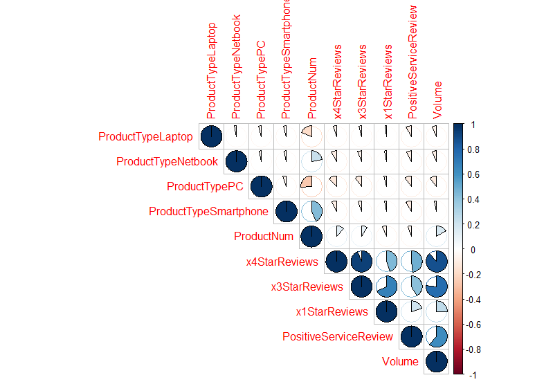

```{r setup, include=FALSE}
knitr::opts_chunk$set(echo = TRUE)
```

```{r Libraries, include=FALSE}
library(readr)
library(caret)
library(lattice)
library(ggplot2)
library (corrplot)
library(mlbench)
library(dplyr)
library(kableExtra)
library(knitr)
```

```{r load data, echo=FALSE}
load("all.RData")
```

# EXECUTIVE SUMMARY

This analysis focus is on determination of how different product types perform 
against eachother and how type of products might impact sales. Service- and customer reviews are considered the most impactfuls for boosting sales and are therefore taken into account. 

## The approach

The approach of the analysis is to analyse historical sales data and then make sales predictions for four different product types being Netbook, PC, Laptop and Smartphone. 

For impact of sales volume the service- and customer reviews were used as 
relevant influencer for sales volume. 

# PREPROCESS
In order to do a proper analysis the data was checked for missing values and type of variables. Using the dummify function within R converted character and factor values to dummy (binary) values.

```{r Dummifying Data, echo=FALSE}
DummyVarsExist <- dummyVars(" ~ .", data = Exist)
readyData <- data.frame(predict(DummyVarsExist, newdata = Exist))
```

## Feature selection
Based on the outcome of the Correlation Matrix a first selection of relevant and impactful features for predicting sales volume were selected. All features with a positive correlation > 0.50 are in the first iteration taken into account. In the final selection the 1 star reviews are left out to optimize the prediction. 

```{r 1st relevant vars, echo=TRUE}
relevant_vars
```

## Plot Correlation Matrix


```{r Outcome Correlation Matrix, include=FALSE}
corrData
```

# MODELLING
After defining a sample set and test and train sets the following models were
trained and test on performance in predicting sales volume and per product type. 

* MODELS
  + Linear Model
  + Random Forest
  + KNN
  + SVM

Based on the performance indicators the Random Forest (RF) had the best results:

>Rsquared 0.865

RF postresample -> postResample(pred = predict(object = rfFit, newdata = testingrf), obs = testingrf$Volume)

>Rsquared 0.94 and a significant lower RMSE (160)
  
```{r Random Forest model, include=FALSE}
rfFit <- readRDS("rfFit.rds")
```

# MODEL ERROR CHECK
To ensure that the model did predict properly an error check is performed.
Also all the models are plotted for the ProductTypes Netbook, Laptop, PC &
Smartphone. Hereafter it was decided to remove two outliers. 

```{r Errorcheck, echo=TRUE}
plot(PlotErrorCheck)
```

## Remove outliers
First the values of the outliers were detected.
```{r Detect Outliers, Echo=FALSE}
outlier_values
```

To further improve the data features are renamed in shorter versions and the
two rows containing the outliers were removed. Also the 1 Star reviews are 
removed to further improve the performance of the models: Finaldf_cleaned <- distinct(.data = final_df_ExOut, PosSerRev, x4Star, x3Star, Volume, .keep_all = TRUE)

```{r Cleaned Data, include=FALSE}
final_df_ExOut
```

Finally duplicates of the product type Extended Warranty were brought back to
one row.

## 2nd iteration of modelling

With this further cleaned data set the complete training and testing of all the 
four models was repeated. All the performance indicators are checked, all
predictions for the four Product Types and per model were plotted. 

Also the performance was test based on the test set:
postResample(pred = predict(object = rfFit2, newdata = testingrf2), obs = testingrf2$Volume)
  RMSE     Rsquared MAE 
  137.120   0.9509  109.22

Based on the outcomes the **Random Forest model** is chosen to predict the volumes of the *new
product selection*. 

```{r 2nd iteration Random Forest, echo=TRUE}
rfFit <- readRDS("rfFit2.rds")
```

The plot below shows the predictions for smartphone sales by the trained model. 

```{r PlotPhone, echo=TRUE}
plot(PlotPhone)
```

# PREPROCES PREDICTION
To predict salesvolume for the ProductTypes Netbook, PC, Smartphone and PC the New product data file
is imported. All preprocessing, selecting relevant feautures etc. was also executed on this data frame. Including the final chosen impactful features for boosting sales.

```{r Final impactful features, echo=FALSE}
Final_relevant_vars
```

Also the not chosen ProductTypes; *Accessoires ,Display, Extended Warranty, GameConsole, Printers, Printer Supplies, SoftWare & Tablet* were excluded for predictions. 

# PREDICTION
The best performing model Random Forest (rfFit2) was used for predicting sales volume. And compared with the predictions by KNN, SVM, LM. All the outcomes were added to the dataframe but PredRF is used for conclusions and recommendations.  

```{r Predictions, echo=FALSE}
rfFit2 <- readRDS("rfFit2.rds")

```

```{r NewData with Random Forest Predicted Volume}
kable(head(NewData)) %>% 
  kable_styling()
```


# CONCLUSION & RECOMMENDATIONS
First it seems that there is a positive and strong relationship between the total number of starts and number of product sales. But it also needs to be noted that the supplied data files with historical & new products seems to have incorrect prices. Mostly it looks like some products have a duplicated number at the end. Therefore it is advised to improve and check the sales data and repeat the analysis done.  

Based on the supplied input it seems that 2 Netbooks, 1 PC and two Smartphones have the best potential for boosting sales.Although the sales volume for the netbook could be incorrect due to earlier mentioned price issues in the data files. 


